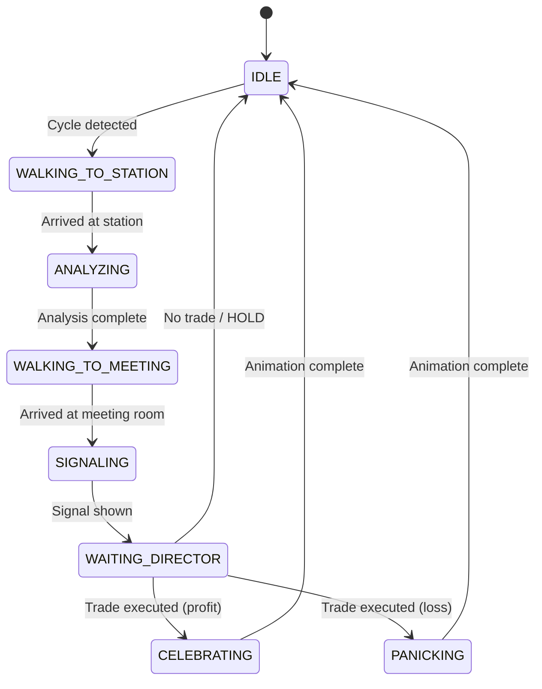

Eldseñ pvl esét reroVGA16-crlee,fecoCRT,yxldeldhbadul,gndonmrndeizdo2Dbd eHTML5Cvse coxicossHMListns(had,kra,).r]
    
    B --> G[StateManage G--> G1[AgentStateMachine]
    G --> G2[EventQueue]
    
    B --> H[EventSystem]
    H --> I[journal.jsonl]
    
    B --> J[UIOverlay]
    J --> J1[DialogBubbles]
    J --> J2[StatsPanel]
    J --> J3[ParticleEffects]
    
    K[Sidebar HTML] --> B
    L[Header HTML] --> B
```

### Integración con Dashboard Actual

El canvas 2D reemplaza el `#agent-grid` actual, manteniendo:
- **Header** (#hdr): Precio BTC, status LND/Boltz, reloj
- **Ticker Tape** (#ticker-tape): Scroll horizontal con datos de mercado
- **Sidebar** (#sidebar): KPIs, kill-switch, battle log
- **Director Banner** (#director): Se mantiene arriba del canvas como "boss banner"

El canvas ocupa el espacio del `#room` actual en el grid layout.

## Components and Interfaces

### Component 1: Canvas2DEngine

**Purpose**: Motor principal que inicializa el canvas, maneja el game loop, y coordina todos los subsistemas.

**Interface**:
```javascript
class Canvas2DEngine {
  constructor(canvasElement, config)
  init()
  start()
  stop()
  update(deltaTime)
  render()
  resize(width, height)
  destroy()
}
```

**Responsibilities**:
- Inicializar canvas con contexto 2D
- Ejecutar game loop a 60 FPS usando requestAnimationFrame
- Coordinar LayerManager, SpriteSystem, MovementSystem, StateManager
- Manejar resize events para responsive design
- Aplicar pixel-perfect rendering (disable image smoothing)

**Configuration**:
```javascript
const config = {
  gridWidth: 20,        // tiles horizontales
  gridHeight: 15,       // tiles verticales
  tileSize: 32,         // px por tile
  targetFPS: 60,
  pixelPerfect: true,
  vgaPalette: { /* VGA colors */ }
}
```

---

### Component 2: LayerManager

**Purpose**: Gestiona las 4 capas de renderizado y optimiza el redibujado.

**Interface**:
```javascript
class LayerManager {
  constructor(canvas, config)
  addLayer(name, zIndex, options)
  getLayer(name)
  renderAll(ctx)
  markDirty(layerName)
  clearLayer(layerName)
}
```

**Layers**:
1. **FloorLayer** (z-index: 0): Piso, paredes, decoración estática
2. **ObjectLayer** (z-index: 1): Escritorios, mesas, monitores, plantas
3. **AgentLayer** (z-index: 2): Sprites de agentes animados
4. **UILayer** (z-index: 3): Burbujas de diálogo, efectos de partículas, overlays

**Optimization Strategy**:
- FloorLayer y ObjectLayer se renderizan a offscreen canvas (solo una vez)
- AgentLayer y UILayer se redibujan cada frame
- Dirty rectangle tracking para minimizar redraws

---

### Component 3: SpriteSystem

**Purpose**: Carga y gestiona sprite sheets, controla animaciones frame-by-frame.

**Interface**:
```javascript
class SpriteSystem {
  loadSpriteSheet(name, imagePath, frameConfig)
  getSprite(name, frame)
  createAnimation(name, frames, duration, loop)
  playAnimation(animationName, onComplete)
}

class AnimationController {
  constructor(spriteSystem)
  update(deltaTime)
  play(animationName, loop)
  stop()
  getCurrentFrame()
}
```

**Sprite Sheet Structure**:
```javascript
const agentSpriteConfig = {
  frameWidth: 24,
  frameHeight: 24,
  animations: {
    idle_down:  { frames: [0, 1], fps: 2 },
    idle_up:    { frames: [2, 3], fps: 2 },
    idle_left:  { frames: [4, 5], fps: 2 },
    idle_right: { frames: [6, 7], fps: 2 },
    walk_down:  { frames: [8, 9, 10, 11], fps: 8 },
    walk_up:    { frames: [12, 13, 14, 15], fps: 8 },
    walk_left:  { frames: [16, 17, 18, 19], fps: 8 },
    walk_right: { frames: [20, 21, 22, 23], fps: 8 },
    think:      { frames: [24, 25, 26], fps: 3 },
    signal_buy: { frames: [27, 28], fps: 4 },
    signal_sell:{ frames: [29, 30], fps: 4 },
    signal_hold:{ frames: [31, 32], fps: 4 },
    celebrate:  { frames: [33, 34, 35, 36], fps: 6 },
    panic:      { frames: [37, 38, 39, 40], fps: 8 }
  }
}
```

**CSS Box-Shadow Alternative**:
Si se mantiene el estilo actual (sprites via CSS box-shadow), el SpriteSystem renderiza cada sprite a un offscreen canvas y lo cachea como imagen.

---

### Component 4: MovementSystem

**Purpose**: Maneja pathfinding, movimiento de agentes, y detección de colisiones.

**Interface**:
```javascript
class MovementSystem {
  constructor(gridWidth, gridHeight, tileSize)
  setObstacles(obstacleGrid)
  findPath(startTile, endTile)
  moveAgent(agent, targetTile, speed)
  update(deltaTime)
  checkCollision(x, y)
}

class PathFinder {
  constructor(grid)
  findPath(start, end, algorithm = 'astar')
  getNeighbors(tile)
  heuristic(a, b)
}
```

**Pathfinding Algorithm**: A* simplificado para grid 20x15
- Heurística: Manhattan distance
- Vecinos: 4-direccional (up, down, left, right)
- Obstáculos: escritorios, paredes, objetos decorativos

**Movement Logic**:
```javascript
// Smooth interpolation entre tiles
function moveAgent(agent, path, speed) {
  const currentTile = agent.tile
  const nextTile = path[agent.pathIndex]
  
  agent.x += (nextTile.x - currentTile.x) * speed * deltaTime
  agent.y += (nextTile.y - currentTile.y) * speed * deltaTime
  
  if (distance(agent, nextTile) < 1) {
    agent.tile = nextTile
    agent.pathIndex++
  }
}
```

**Speed**: 2 tiles/segundo (64px/s)

---

### Component 5: StateManager

**Purpose**: Gestiona el estado global del sistema y las máquinas de estado de cada agente.

**Interface**:
```javascript
class StateManager {
  constructor()
  setState(key, value)
  getState(key)
  subscribe(key, callback)
  getAgentState(agentId)
  transitionAgent(agentId, newState)
}

class AgentStateMachine {
  constructor(agentId, initialState)
  transition(newState)
  getCurrentState()
  canTransition(targetState)
  onEnter(state, callback)
  onExit(state, callback)
}
```

**Agent State Machine**:


**Global States**:
- `systemState`: 'IDLE' | 'ANALYZING' | 'MEETING' | 'EXECUTING' | 'COOLDOWN'
- `lastCycleTimestamp`: timestamp del último ciclo procesado
- `activeAgents`: array de agentes activos
- `directorVerdict`: { action, confidence, reason }


---

### Component 6: EventSystem

**Purpose**: Sincroniza eventos del journal.jsonl con el sistema 2D.

**Interface**:
```javascript
class EventSystem {
  constructor(stateManager, journalPath)
  startPolling(interval = 8000)
  stopPolling()
  processJournalEntry(entry)
  emit(eventName, data)
  on(eventName, callback)
}
```

**Event Flow**:
```javascript
// Polling journal.jsonl cada 8 segundos
async function pollJournal() {
  const entries = await loadJournal()
  const lastEntry = entries[entries.length - 1]
  
  if (lastEntry.timestamp > lastProcessedTimestamp) {
    processJournalEntry(lastEntry)
    lastProcessedTimestamp = lastEntry.timestamp
  }
}

// Mapeo de eventos journal → animaciones
function processJournalEntry(entry) {
  if (entry.event === 'CYCLE') {
    emit('cycle:start', { signals: entry.agent_signals })
    // Trigger: agents walk to stations
  }
  
  if (entry.claude_decision) {
    emit('director:verdict', entry.claude_decision)
    // Trigger: director animation
  }
  
  if (entry.result?.status === 'EJECUTADO') {
    const profit = entry.result.action === 'COMPRAR_BTC'
    emit('trade:executed', { profit })
    // Trigger: celebration or panic animations
  }
}
```

**Events Emitted**:
- `cycle:start` → Agentes caminan a estaciones
- `agent:analyzing` → Animación "thinking"
- `agent:signal` → Muestra señal BUY/SELL/HOLD
- `meeting:start` → Agentes van a sala central
- `director:verdict` → Director da veredicto
- `trade:executed` → Animación celebración/pánico
- `cycle:complete` → Volver a IDLE

---

### Component 7: UIOverlay

**Purpose**: Renderiza elementos UI sobre el canvas (burbujas, panels, partículas).

**Interface**:
```javascript
class UIOverlay {
  constructor(canvas, ctx)
  showDialogBubble(agent, text, duration)
  hideDialogBubble(agent)
  showStatsPanel(agent, stats)
  hideStatsPanel()
  spawnParticles(x, y, type, count)
  update(deltaTime)
  render(ctx)
}

class DialogBubble {
  constructor(x, y, text, style)
  render(ctx)
  update(deltaTime)
  isExpired()
}

class ParticleEffect {
  constructor(x, y, type, config)
  update(deltaTime)
  render(ctx)
  isDead()
}
```

**Dialog Bubble Style** (RPG-style):
```javascript
const bubbleStyle = {
  bgColor: '#000000',
  borderColor: '#00aaaa',
  textColor: '#cccccc',
  font: '6px "Press Start 2P"',
  padding: 8,
  tailSize: 6,
  maxWidth: 120,
  lineHeight: 10
}

function renderBubble(ctx, x, y, text) {
  // Draw rounded rect with tail pointing to agent
  // Wrap text to maxWidth
  // Render with pixel-perfect alignment
}
```

**Particle Types**:
- `sparkle`: Celebración (verde/amarillo)
- `explosion`: Pánico (rojo/naranja)
- `signal`: Indicador de señal (color según BUY/SELL/HOLD)
- `alert`: Alerta de kill-switch (rojo parpadeante)

---

## Data Models

### Model 1: Agent

```javascript
class Agent {
  constructor(id, name, type, config) {
    this.id = id                    // 'tech', 'quant', 'fund', 'sent', 'risk'
    this.name = name                // 'TICKER', 'LA MAQUINA', etc.
    this.type = type                // 'technical', 'quant', etc.
    this.tile = { x: 0, y: 0 }      // Posición en grid
    this.pixelPos = { x: 0, y: 0 }  // Posición en pixels (smooth movement)
    this.direction = 'down'         // 'up', 'down', 'left', 'right'
    this.state = 'IDLE'             // Estado actual de la FSM
    this.animation = null           // AnimationController instance
    this.path = []                  // Path actual (array de tiles)
    this.pathIndex = 0              // Índice en el path
    this.speed = 2                  // tiles/segundo
    this.signal = null              // { signal: 'BUY', confidence: 0.8, reason: '...' }
    this.stats = {                  // Stats del agente
      confidence: 0,
      wins: 0,
      losses: 0,
      xp: 0,
      level: 1
    }
    this.homeDesk = { x: 0, y: 0 }  // Posición del escritorio
    this.spriteSheet = null         // SpriteSheet instance
    this.color = config.color       // Color theme (VGA palette)
  }
}
```

**Validation Rules**:
- `tile.x` debe estar en rango [0, gridWidth-1]
- `tile.y` debe estar en rango [0, gridHeight-1]
- `direction` debe ser uno de: 'up', 'down', 'left', 'right'
- `state` debe ser un estado válido de la FSM
- `speed` debe ser > 0

---

### Model 2: Tile

```javascript
class Tile {
  constructor(x, y, type, walkable = true) {
    this.x = x                      // Coordenada X en grid
    this.y = y                      // Coordenada Y en grid
    this.type = type                // 'floor', 'wall', 'desk', 'decoration'
    this.walkable = walkable        // ¿Se puede caminar sobre este tile?
    this.occupant = null            // Agent que ocupa este tile (si hay)
    this.sprite = null              // Sprite a renderizar
  }
  
  toPixels(tileSize) {
    return { x: this.x * tileSize, y: this.y * tileSize }
  }
}
```

---

### Model 3: SceneLayout

```javascript
const sceneLayout = {
  grid: {
    width: 20,
    height: 15,
    tileSize: 32
  },
  
  zones: {
    desks: [
      { agent: 'tech',  tile: { x: 2, y: 2 } },
      { agent: 'quant', tile: { x: 7, y: 2 } },
      { agent: 'fund',  tile: { x: 12, y: 2 } },
      { agent: 'sent',  tile: { x: 17, y: 2 } },
      { agent: 'risk',  tile: { x: 2, y: 7 } }
    ],
    
    meetingRoom: {
      center: { x: 10, y: 8 },
      seats: [
        { x: 8, y: 8 },   // tech
        { x: 12, y: 8 },  // quant
        { x: 10, y: 6 },  // fund
        { x: 10, y: 10 }, // sent
        { x: 14, y: 8 }   // risk
      ]
    },
    
    serverRoom: {
      tile: { x: 2, y: 12 },
      objects: ['lnd-server', 'boltz-server']
    },
    
    marketScreens: {
      tile: { x: 17, y: 12 },
      objects: ['btc-chart', 'ticker-screen']
    }
  },
  
  obstacles: [
    // Paredes
    ...generateWalls(),
    // Escritorios
    { x: 2, y: 2, w: 2, h: 1 },
    { x: 7, y: 2, w: 2, h: 1 },
    // ... más obstáculos
  ],
  
  decorations: [
    { type: 'plant', tile: { x: 5, y: 5 } },
    { type: 'coffee', tile: { x: 15, y: 5 } },
    { type: 'cables', tile: { x: 3, y: 12 } }
  ]
}
```


## Algorithmic Pseudocode

### Main Game Loop

```javascript
class Canvas2DEngine {
  constructor(canvas, config) {
    this.canvas = canvas
    this.ctx = canvas.getContext('2d')
    this.config = config
    this.lastFrameTime = 0
    this.running = false
    
    // Subsystems
    this.layerManager = new LayerManager(canvas, config)
    this.spriteSystem = new SpriteSystem()
    this.movementSystem = new MovementSystem(config.gridWidth, config.gridHeight, config.tileSize)
    this.stateManager = new StateManager()
    this.eventSystem = new EventSystem(this.stateManager, 'journal.jsonl')
    this.uiOverlay = new UIOverlay(canvas, this.ctx)
    
    // Agents
    this.agents = []
  }
  
  init() {
    // Disable image smoothing for pixel-perfect rendering
    this.ctx.imageSmoothingEnabled = false
    
    // Initialize layers
    this.layerManager.addLayer('floor', 0, { static: true })
    this.layerManager.addLayer('objects', 1, { static: true })
    this.layerManager.addLayer('agents', 2, { static: false })
    this.layerManager.addLayer('ui', 3, { static: false })
    
    // Load sprites
    await this.loadAllSprites()
    
    // Create agents
    this.createAgents()
    
    // Render static layers once
    this.renderStaticLayers()
    
    // Start event polling
    this.eventSystem.startPolling(8000)
    
    // Setup event listeners
    this.setupEventListeners()
  }
  
  start() {
    this.running = true
    this.lastFrameTime = performance.now()
    this.gameLoop()
  }
  
  gameLoop() {
    if (!this.running) return
    
    const currentTime = performance.now()
    const deltaTime = (currentTime - this.lastFrameTime) / 1000 // seconds
    this.lastFrameTime = currentTime
    
    // Update
    this.update(deltaTime)
    
    // Render
    this.render()
    
    // Next frame
    requestAnimationFrame(() => this.gameLoop())
  }
  
  update(deltaTime) {
    // Update agent animations
    this.agents.forEach(agent => {
      if (agent.animation) {
        agent.animation.update(deltaTime)
      }
    })
    
    // Update movement
    this.movementSystem.update(deltaTime)
    
    // Update UI overlay (particles, bubbles)
    this.uiOverlay.update(deltaTime)
  }
  
  render() {
    // Clear dynamic layers
    this.layerManager.clearLayer('agents')
    this.layerManager.clearLayer('ui')
    
    // Render agents
    const agentLayer = this.layerManager.getLayer('agents')
    this.agents.forEach(agent => {
      this.renderAgent(agentLayer.ctx, agent)
    })
    
    // Render UI overlay
    const uiLayer = this.layerManager.getLayer('ui')
    this.uiOverlay.render(uiLayer.ctx)
    
    // Composite all layers to main canvas
    this.layerManager.renderAll(this.ctx)
  }
  
  renderAgent(ctx, agent) {
    const frame = agent.animation.getCurrentFrame()
    const sprite = this.spriteSystem.getSprite(agent.spriteSheet, frame)
    
    ctx.drawImage(
      sprite,
      agent.pixelPos.x,
      agent.pixelPos.y,
      24, // sprite width
      24  // sprite height
    )
  }
}
```

**Preconditions**:
- Canvas element existe en el DOM
- Config contiene gridWidth, gridHeight, tileSize válidos
- journal.jsonl es accesible vía fetch

**Postconditions**:
- Game loop ejecuta a ~60 FPS
- Agentes se renderizan correctamente
- Eventos del journal se procesan cada 8 segundos

**Loop Invariants**:
- `deltaTime` siempre es positivo
- Todos los agentes tienen posiciones válidas dentro del grid
- Layers se renderizan en orden correcto (z-index)

---

### Pathfinding Algorithm (A*)

```javascript
class PathFinder {
  constructor(grid) {
    this.grid = grid  // 2D array de Tiles
    this.width = grid[0].length
    this.height = grid.length
  }
  
  findPath(start, end) {
    // A* implementation
    const openSet = [start]
    const cameFrom = new Map()
    const gScore = new Map()
    const fScore = new Map()
    
    gScore.set(this.tileKey(start), 0)
    fScore.set(this.tileKey(start), this.heuristic(start, end))
    
    while (openSet.length > 0) {
      // Get tile with lowest fScore
      const current = this.getLowestFScore(openSet, fScore)
      
      if (current.x === end.x && current.y === end.y) {
        return this.reconstructPath(cameFrom, current)
      }
      
      openSet.splice(openSet.indexOf(current), 1)
      
      const neighbors = this.getNeighbors(current)
      for (const neighbor of neighbors) {
        if (!neighbor.walkable) continue
        
        const tentativeGScore = gScore.get(this.tileKey(current)) + 1
        const neighborKey = this.tileKey(neighbor)
        
        if (!gScore.has(neighborKey) || tentativeGScore < gScore.get(neighborKey)) {
          cameFrom.set(neighborKey, current)
          gScore.set(neighborKey, tentativeGScore)
          fScore.set(neighborKey, tentativeGScore + this.heuristic(neighbor, end))
          
          if (!openSet.includes(neighbor)) {
            openSet.push(neighbor)
          }
        }
      }
    }
    
    return [] // No path found
  }
  
  heuristic(a, b) {
    // Manhattan distance
    return Math.abs(a.x - b.x) + Math.abs(a.y - b.y)
  }
  
  getNeighbors(tile) {
    const neighbors = []
    const directions = [
      { x: 0, y: -1 }, // up
      { x: 0, y: 1 },  // down
      { x: -1, y: 0 }, // left
      { x: 1, y: 0 }   // right
    ]
    
    for (const dir of directions) {
      const nx = tile.x + dir.x
      const ny = tile.y + dir.y
      
      if (nx >= 0 && nx < this.width && ny >= 0 && ny < this.height) {
        neighbors.push(this.grid[ny][nx])
      }
    }
    
    return neighbors
  }
  
  reconstructPath(cameFrom, current) {
    const path = [current]
    let key = this.tileKey(current)
    
    while (cameFrom.has(key)) {
      current = cameFrom.get(key)
      path.unshift(current)
      key = this.tileKey(current)
    }
    
    return path
  }
  
  tileKey(tile) {
    return `${tile.x},${tile.y}`
  }
}
```

**Preconditions**:
- `start` y `end` son tiles válidos dentro del grid
- Grid contiene información de walkability correcta

**Postconditions**:
- Retorna array de tiles formando un path válido
- Si no hay path, retorna array vacío
- Path no incluye tiles con `walkable: false`

**Loop Invariants**:
- `openSet` contiene solo tiles no visitados
- `gScore` contiene el costo mínimo conocido para llegar a cada tile
- Todos los tiles en `openSet` tienen un `fScore` válido

---

### Agent State Transition Algorithm

```javascript
class AgentStateMachine {
  constructor(agentId, initialState = 'IDLE') {
    this.agentId = agentId
    this.currentState = initialState
    this.previousState = null
    this.stateEnterCallbacks = new Map()
    this.stateExitCallbacks = new Map()
    
    // Valid transitions
    this.transitions = {
      'IDLE': ['WALKING_TO_STATION'],
      'WALKING_TO_STATION': ['ANALYZING'],
      'ANALYZING': ['WALKING_TO_MEETING'],
      'WALKING_TO_MEETING': ['SIGNALING'],
      'SIGNALING': ['WAITING_DIRECTOR'],
      'WAITING_DIRECTOR': ['CELEBRATING', 'PANICKING', 'IDLE'],
      'CELEBRATING': ['IDLE'],
      'PANICKING': ['IDLE']
    }
  }
  
  transition(newState) {
    if (!this.canTransition(newState)) {
      console.warn(`Invalid transition: ${this.currentState} -> ${newState}`)
      return false
    }
    
    // Exit current state
    if (this.stateExitCallbacks.has(this.currentState)) {
      this.stateExitCallbacks.get(this.currentState)()
    }
    
    this.previousState = this.currentState
    this.currentState = newState
    
    // Enter new state
    if (this.stateEnterCallbacks.has(newState)) {
      this.stateEnterCallbacks.get(newState)()
    }
    
    return true
  }
  
  canTransition(targetState) {
    const validTransitions = this.transitions[this.currentState] || []
    return validTransitions.includes(targetState)
  }
  
  onEnter(state, callback) {
    this.stateEnterCallbacks.set(state, callback)
  }
  
  onExit(state, callback) {
    this.stateExitCallbacks.set(state, callback)
  }
}
```

**Preconditions**:
- `newState` es un string válido
- FSM está inicializada con un estado válido

**Postconditions**:
- Si transición es válida: `currentState` cambia a `newState`
- Si transición es inválida: `currentState` no cambia, retorna `false`
- Callbacks de exit/enter se ejecutan en orden correcto

---

### Event Processing Algorithm

```javascript
class EventSystem {
  processJournalEntry(entry) {
    const timestamp = entry.timestamp
    
    // Skip if already processed
    if (timestamp <= this.lastProcessedTimestamp) {
      return
    }
    
    this.lastProcessedTimestamp = timestamp
    
    // Process based on event type
    switch (entry.event) {
      case 'CYCLE':
        this.handleCycleStart(entry)
        break
        
      case 'DECISION':
        this.handleDirectorDecision(entry)
        break
        
      case 'EXECUTION':
        this.handleTradeExecution(entry)
        break
        
      case 'ERROR':
        this.handleError(entry)
        break
    }
  }
  
  handleCycleStart(entry) {
    // Emit cycle:start event
    this.emit('cycle:start', {
      timestamp: entry.timestamp,
      signals: entry.agent_signals || []
    })
    
    // Transition all agents to WALKING_TO_STATION
    entry.agent_signals.forEach(signal => {
      const agent = this.getAgent(signal.agent)
      if (agent) {
        agent.stateMachine.transition('WALKING_TO_STATION')
        agent.signal = signal
        
        // Calculate path to station
        const path = this.pathFinder.findPath(agent.tile, agent.homeDesk)
        this.movementSystem.moveAgent(agent, path, agent.speed)
      }
    })
  }
  
  handleDirectorDecision(entry) {
    const decision = entry.claude_decision
    
    this.emit('director:verdict', {
      action: decision.accion,
      confidence: decision.confianza,
      reason: decision.razon
    })
    
    // Show director animation
    this.showDirectorVerdict(decision)
  }
  
  handleTradeExecution(entry) {
    const result = entry.result
    const profit = this.calculateProfit(result)
    
    this.emit('trade:executed', {
      action: result.action,
      profit: profit,
      amount: result.amount
    })
    
    // Transition agents to CELEBRATING or PANICKING
    const newState = profit > 0 ? 'CELEBRATING' : 'PANICKING'
    this.agents.forEach(agent => {
      agent.stateMachine.transition(newState)
    })
    
    // Spawn particles
    this.uiOverlay.spawnParticles(
      this.meetingRoomCenter.x,
      this.meetingRoomCenter.y,
      profit > 0 ? 'sparkle' : 'explosion',
      20
    )
  }
}
```

**Preconditions**:
- `entry` es un objeto JSON válido del journal
- `entry.timestamp` existe y es un string ISO 8601
- Agentes están inicializados

**Postconditions**:
- Eventos se emiten en orden cronológico
- Agentes transicionan a estados correctos
- UI se actualiza con nueva información


## Example Usage

### Initialization

```javascript
// 1. Create canvas element in HTML (replaces #agent-grid)
const canvas = document.createElement('canvas')
canvas.id = 'trading-floor-canvas'
canvas.width = 640  // 20 tiles * 32px
canvas.height = 480 // 15 tiles * 32px
document.getElementById('room').appendChild(canvas)

// 2. Initialize engine
const config = {
  gridWidth: 20,
  gridHeight: 15,
  tileSize: 32,
  targetFPS: 60,
  pixelPerfect: true,
  vgaPalette: {
    black: '#000000',
    dblue: '#0000aa',
    blue: '#5555ff',
    dgreen: '#00aa00',
    green: '#55ff55',
    dred: '#aa0000',
    red: '#ff5555',
    // ... resto de colores VGA
  }
}

const engine = new Canvas2DEngine(canvas, config)

// 3. Initialize and start
await engine.init()
engine.start()

// 4. Setup event handlers
engine.eventSystem.on('cycle:start', (data) => {
  console.log('Cycle started:', data)
  // Update sidebar stats
  updateSidebarStats(data)
})

engine.eventSystem.on('trade:executed', (data) => {
  console.log('Trade executed:', data)
  // Flash screen effect
  triggerTradeFlash(data.profit > 0)
})

// 5. Handle canvas clicks for agent interaction
canvas.addEventListener('click', (e) => {
  const rect = canvas.getBoundingClientRect()
  const x = e.clientX - rect.left
  const y = e.clientY - rect.top
  
  const clickedAgent = engine.getAgentAtPosition(x, y)
  if (clickedAgent) {
    engine.uiOverlay.showStatsPanel(clickedAgent, clickedAgent.stats)
  }
})
```

---

### Creating Agents

```javascript
function createAgents() {
  const agentConfigs = [
    {
      id: 'tech',
      name: 'TICKER',
      type: 'technical',
      homeDesk: { x: 2, y: 2 },
      color: '#5555ff',
      spriteSheet: 'tech-sprite'
    },
    {
      id: 'quant',
      name: 'LA MAQUINA',
      type: 'quant',
      homeDesk: { x: 7, y: 2 },
      color: '#55ff55',
      spriteSheet: 'quant-sprite'
    },
    {
      id: 'fund',
      name: 'ECONOMISTA',
      type: 'fundamental',
      homeDesk: { x: 12, y: 2 },
      color: '#ffff55',
      spriteSheet: 'fund-sprite'
    },
    {
      id: 'sent',
      name: 'PERIODISTA',
      type: 'sentiment',
      homeDesk: { x: 17, y: 2 },
      color: '#ff55ff',
      spriteSheet: 'sent-sprite'
    },
    {
      id: 'risk',
      name: 'JEFE RIESGO',
      type: 'risk',
      homeDesk: { x: 2, y: 7 },
      color: '#ff5555',
      spriteSheet: 'risk-sprite'
    }
  ]
  
  agentConfigs.forEach(config => {
    const agent = new Agent(config.id, config.name, config.type, config)
    agent.tile = config.homeDesk
    agent.pixelPos = {
      x: config.homeDesk.x * this.config.tileSize,
      y: config.homeDesk.y * this.config.tileSize
    }
    
    // Setup state machine
    agent.stateMachine = new AgentStateMachine(agent.id, 'IDLE')
    
    // Setup animations
    agent.animation = new AnimationController(this.spriteSystem)
    agent.animation.play('idle_down', true)
    
    // Setup state callbacks
    this.setupAgentStateCallbacks(agent)
    
    this.agents.push(agent)
  })
}

function setupAgentStateCallbacks(agent) {
  agent.stateMachine.onEnter('WALKING_TO_STATION', () => {
    // Start walk animation
    agent.animation.play(`walk_${agent.direction}`, true)
  })
  
  agent.stateMachine.onEnter('ANALYZING', () => {
    // Play thinking animation
    agent.animation.play('think', true)
    
    // Show dialog bubble
    this.uiOverlay.showDialogBubble(
      agent,
      agent.signal.reason.substring(0, 60) + '...',
      5000
    )
  })
  
  agent.stateMachine.onEnter('SIGNALING', () => {
    // Play signal animation based on signal type
    const signalType = agent.signal.signal.toLowerCase()
    agent.animation.play(`signal_${signalType}`, true)
    
    // Show signal bubble
    this.uiOverlay.showDialogBubble(
      agent,
      `${agent.signal.signal} (${Math.round(agent.signal.confidence * 10)}/10)`,
      3000
    )
  })
  
  agent.stateMachine.onEnter('CELEBRATING', () => {
    agent.animation.play('celebrate', false)
    this.uiOverlay.spawnParticles(agent.pixelPos.x, agent.pixelPos.y, 'sparkle', 10)
  })
  
  agent.stateMachine.onEnter('PANICKING', () => {
    agent.animation.play('panic', false)
    this.uiOverlay.spawnParticles(agent.pixelPos.x, agent.pixelPos.y, 'explosion', 10)
  })
  
  agent.stateMachine.onEnter('IDLE', () => {
    agent.animation.play('idle_down', true)
  })
}
```

---

### Rendering Static Layers

```javascript
function renderStaticLayers() {
  // Floor layer
  const floorLayer = this.layerManager.getLayer('floor')
  const floorCtx = floorLayer.ctx
  
  // Draw floor tiles
  for (let y = 0; y < this.config.gridHeight; y++) {
    for (let x = 0; x < this.config.gridWidth; x++) {
      const tile = this.grid[y][x]
      const px = x * this.config.tileSize
      const py = y * this.config.tileSize
      
      // Checkerboard pattern
      const color = (x + y) % 2 === 0 ? '#0c0c0c' : '#111111'
      floorCtx.fillStyle = color
      floorCtx.fillRect(px, py, this.config.tileSize, this.config.tileSize)
      
      // Grid lines (subtle)
      floorCtx.strokeStyle = 'rgba(0, 170, 0, 0.05)'
      floorCtx.strokeRect(px, py, this.config.tileSize, this.config.tileSize)
    }
  }
  
  // Object layer
  const objectLayer = this.layerManager.getLayer('objects')
  const objectCtx = objectLayer.ctx
  
  // Draw desks
  this.sceneLayout.zones.desks.forEach(desk => {
    const px = desk.tile.x * this.config.tileSize
    const py = desk.tile.y * this.config.tileSize
    
    // Simple desk sprite (2x1 tiles)
    objectCtx.fillStyle = '#555555'
    objectCtx.fillRect(px, py, this.config.tileSize * 2, this.config.tileSize)
    
    // Monitor on desk
    objectCtx.fillStyle = '#0000aa'
    objectCtx.fillRect(px + 8, py + 4, 16, 12)
  })
  
  // Draw meeting table
  const meetingCenter = this.sceneLayout.zones.meetingRoom.center
  const px = meetingCenter.x * this.config.tileSize
  const py = meetingCenter.y * this.config.tileSize
  
  objectCtx.fillStyle = '#aa5500'
  objectCtx.beginPath()
  objectCtx.arc(px, py, this.config.tileSize * 1.5, 0, Math.PI * 2)
  objectCtx.fill()
  
  // Draw decorations
  this.sceneLayout.decorations.forEach(deco => {
    this.renderDecoration(objectCtx, deco)
  })
}
```

---

### Handling Responsive Resize

```javascript
function handleResize() {
  const container = document.getElementById('room')
  const containerWidth = container.clientWidth
  const containerHeight = container.clientHeight
  
  // Calculate scale to fit container while maintaining aspect ratio
  const scaleX = containerWidth / (this.config.gridWidth * this.config.tileSize)
  const scaleY = containerHeight / (this.config.gridHeight * this.config.tileSize)
  const scale = Math.min(scaleX, scaleY, 1) // Don't scale up beyond 1x
  
  // Apply CSS transform for scaling
  this.canvas.style.transform = `scale(${scale})`
  this.canvas.style.transformOrigin = 'top left'
  
  // Update click coordinate conversion
  this.clickScale = scale
}

// Setup resize listener
window.addEventListener('resize', () => this.handleResize())
this.handleResize() // Initial call
```

---

## Error Handling

### Error Scenario 1: Journal Load Failure

**Condition**: fetch('journal.jsonl') falla (404, network error, CORS)
**Response**: 
- Log error a console
- Mostrar mensaje en UI: "Sin conexión con journal.jsonl"
- Continuar renderizando escena en estado IDLE
- Reintentar cada 30 segundos

**Recovery**:
```javascript
async function loadJournal() {
  try {
    const response = await fetch('journal.jsonl?t=' + Date.now())
    if (!response.ok) throw new Error(`HTTP ${response.status}`)
    const text = await response.text()
    return parseJournalLines(text)
  } catch (error) {
    console.error('Journal load failed:', error)
    this.showErrorOverlay('Sin conexión con journal.jsonl')
    
    // Retry after 30s
    setTimeout(() => this.loadJournal(), 30000)
    return []
  }
}
```

---

### Error Scenario 2: Sprite Load Failure

**Condition**: Imagen de sprite sheet no carga (404, formato inválido)
**Response**:
- Fallback a sprites CSS box-shadow (estilo actual)
- Log warning a console
- Continuar con funcionalidad reducida

**Recovery**:
```javascript
async function loadSpriteSheet(name, path) {
  try {
    const img = new Image()
    img.src = path
    await img.decode()
    this.spriteSheets.set(name, img)
  } catch (error) {
    console.warn(`Sprite sheet ${name} failed to load, using CSS fallback`)
    this.spriteSheets.set(name, this.generateCSSSprite(name))
  }
}
```

---

### Error Scenario 3: Pathfinding Failure

**Condition**: No se encuentra path entre dos tiles (obstáculos bloquean)
**Response**:
- Agent se queda en posición actual
- Transiciona directamente al siguiente estado sin moverse
- Log warning con detalles

**Recovery**:
```javascript
function moveAgentToTile(agent, targetTile) {
  const path = this.pathFinder.findPath(agent.tile, targetTile)
  
  if (path.length === 0) {
    console.warn(`No path found for ${agent.id} to ${targetTile.x},${targetTile.y}`)
    // Skip movement, transition to next state immediately
    agent.stateMachine.transition(this.getNextState(agent.state))
    return
  }
  
  this.movementSystem.moveAgent(agent, path, agent.speed)
}
```

---

### Error Scenario 4: Invalid State Transition

**Condition**: Se intenta transición inválida en FSM (ej: IDLE → CELEBRATING)
**Response**:
- Rechazar transición
- Log warning con estado actual y target
- Mantener estado actual

**Recovery**:
```javascript
transition(newState) {
  if (!this.canTransition(newState)) {
    console.warn(
      `Invalid transition for ${this.agentId}: ${this.currentState} -> ${newState}`
    )
    return false
  }
  
  // ... proceed with transition
}
```

---

### Error Scenario 5: Performance Degradation

**Condition**: FPS cae por debajo de 30 (dispositivo lento, muchas partículas)
**Response**:
- Reducir número de partículas activas
- Desactivar efectos no esenciales
- Mostrar warning en console

**Recovery**:
```javascript
function monitorPerformance() {
  const fps = this.calculateFPS()
  
  if (fps < 30) {
    console.warn(`Low FPS detected: ${fps}`)
    
    // Reduce particle count
    this.uiOverlay.maxParticles = Math.max(10, this.uiOverlay.maxParticles / 2)
    
    // Disable shadows
    this.ctx.shadowBlur = 0
    
    // Simplify animations
    this.spriteSystem.skipFrames = true
  }
}
```


## Testing Strategy

### Unit Testing Approach

**Framework**: Ninguno (vanilla JS) - usar assertions manuales o integrar Jest si se desea

**Key Test Cases**:

1. **PathFinder Tests**:
   - Path encontrado entre dos tiles walkable
   - No path cuando tiles están bloqueados por obstáculos
   - Path más corto se selecciona (A* optimality)
   - Vecinos correctos se generan (4-direccional)
   - Heurística Manhattan correcta

2. **AgentStateMachine Tests**:
   - Transiciones válidas se permiten
   - Transiciones inválidas se rechazan
   - Callbacks onEnter/onExit se ejecutan
   - Estado inicial correcto

3. **AnimationController Tests**:
   - Frames avanzan correctamente con deltaTime
   - Loop animations se repiten
   - Non-loop animations se detienen al final
   - getCurrentFrame retorna frame correcto

4. **EventSystem Tests**:
   - Eventos se emiten correctamente
   - Listeners se ejecutan
   - Journal entries se procesan en orden
   - Timestamps duplicados se ignoran

**Example Test**:
```javascript
function testPathFinder() {
  const grid = createTestGrid(5, 5)
  const pathFinder = new PathFinder(grid)
  
  const start = grid[0][0]
  const end = grid[4][4]
  const path = pathFinder.findPath(start, end)
  
  console.assert(path.length > 0, 'Path should be found')
  console.assert(path[0] === start, 'Path should start at start tile')
  console.assert(path[path.length - 1] === end, 'Path should end at end tile')
  
  // Test with obstacle
  grid[2][2].walkable = false
  const pathWithObstacle = pathFinder.findPath(start, end)
  console.assert(
    !pathWithObstacle.some(t => t.x === 2 && t.y === 2),
    'Path should avoid obstacle'
  )
}
```

---

### Integration Testing Approach

**Approach**: Manual testing con journal.jsonl de prueba

**Test Scenarios**:

1. **Full Cycle Flow**:
   - Cargar journal con ciclo completo
   - Verificar que agentes caminan a estaciones
   - Verificar animaciones "thinking"
   - Verificar señales se muestran
   - Verificar director da veredicto
   - Verificar animación celebración/pánico

2. **Multiple Cycles**:
   - Cargar journal con 5+ ciclos
   - Verificar que agentes vuelven a IDLE entre ciclos
   - Verificar que stats se actualizan correctamente
   - Verificar que no hay memory leaks (partículas se limpian)

3. **Error Conditions**:
   - Journal vacío → agentes en IDLE
   - Journal con errores → error handling correcto
   - Señales faltantes → agentes manejan gracefully

4. **UI Interactions**:
   - Click en agente → stats panel se muestra
   - Click fuera de agente → panel se cierra
   - Hover sobre agente → cursor cambia
   - Burbujas de diálogo se muestran y desaparecen

**Test Journal** (journal_test.jsonl):
```jsonl
{"timestamp":"2025-01-15T10:00:00Z","event":"CYCLE","btc_price":95000,"agent_signals":[{"agent":"trader-technical","signal":"BUY","confidence":0.8,"reason":"RSI oversold + bullish divergence"}]}
{"timestamp":"2025-01-15T10:00:05Z","event":"DECISION","claude_decision":{"accion":"COMPRAR","confianza":8,"razon":"Consenso alcista fuerte"}}
{"timestamp":"2025-01-15T10:00:10Z","event":"EXECUTION","result":{"status":"EJECUTADO","action":"COMPRAR_BTC","amount":10000}}
```

---

### Visual Testing

**Approach**: Capturas de pantalla y comparación visual

**Test Cases**:
1. Escena inicial (agentes en escritorios, IDLE)
2. Agentes caminando (walk animation, 4 direcciones)
3. Agentes pensando (think animation)
4. Agentes señalando (signal animations: BUY/SELL/HOLD)
5. Celebración (celebrate animation + partículas verdes)
6. Pánico (panic animation + partículas rojas)
7. Burbujas de diálogo (diferentes tamaños de texto)
8. Stats panel (overlay con stats del agente)

**Checklist Visual**:
- [ ] Sprites se renderizan pixel-perfect (sin blur)
- [ ] Colores VGA correctos
- [ ] Animaciones smooth a 60 FPS
- [ ] Grid floor visible y alineado
- [ ] Objetos (escritorios, mesa) en posiciones correctas
- [ ] Partículas se ven bien y no causan lag
- [ ] Burbujas de diálogo legibles
- [ ] CRT overlay no interfiere con canvas

---

## Performance Considerations

### Rendering Optimization

**Strategy**: Minimizar redraws usando dirty rectangle tracking y offscreen canvases

**Techniques**:
1. **Static Layer Caching**: Floor y Objects se renderizan una vez a offscreen canvas
2. **Dirty Rectangles**: Solo redibujar áreas que cambiaron
3. **Object Pooling**: Reusar objetos Particle en lugar de crear/destruir
4. **Sprite Caching**: Pre-renderizar sprites CSS box-shadow a canvas

**Implementation**:
```javascript
class LayerManager {
  constructor(canvas, config) {
    this.layers = new Map()
    this.dirtyRects = []
  }
  
  markDirty(x, y, width, height) {
    this.dirtyRects.push({ x, y, width, height })
  }
  
  renderAll(ctx) {
    if (this.dirtyRects.length === 0) {
      // Full render
      this.layers.forEach(layer => {
        ctx.drawImage(layer.canvas, 0, 0)
      })
    } else {
      // Partial render (dirty rectangles only)
      this.dirtyRects.forEach(rect => {
        ctx.clearRect(rect.x, rect.y, rect.width, rect.height)
        this.layers.forEach(layer => {
          ctx.drawImage(
            layer.canvas,
            rect.x, rect.y, rect.width, rect.height,
            rect.x, rect.y, rect.width, rect.height
          )
        })
      })
      this.dirtyRects = []
    }
  }
}
```

**Expected Performance**:
- 60 FPS en desktop (Chrome, Firefox, Safari)
- 30-45 FPS en mobile (depende del dispositivo)
- <5ms por frame en update logic
- <10ms por frame en render logic

---

### Memory Management

**Strategy**: Evitar memory leaks con cleanup explícito

**Techniques**:
1. **Particle Pooling**: Pool de 100 partículas pre-creadas
2. **Event Listener Cleanup**: removeEventListener en destroy()
3. **Animation Frame Cancellation**: cancelAnimationFrame en stop()
4. **Sprite Sheet Disposal**: Liberar imágenes cuando no se usan

**Implementation**:
```javascript
class ParticlePool {
  constructor(size = 100) {
    this.pool = []
    for (let i = 0; i < size; i++) {
      this.pool.push(new Particle())
    }
    this.activeParticles = []
  }
  
  spawn(x, y, type) {
    const particle = this.pool.pop()
    if (!particle) return null // Pool exhausted
    
    particle.reset(x, y, type)
    this.activeParticles.push(particle)
    return particle
  }
  
  update(deltaTime) {
    for (let i = this.activeParticles.length - 1; i >= 0; i--) {
      const particle = this.activeParticles[i]
      particle.update(deltaTime)
      
      if (particle.isDead()) {
        this.activeParticles.splice(i, 1)
        this.pool.push(particle) // Return to pool
      }
    }
  }
}
```

---

### Mobile Optimization

**Strategy**: Detectar mobile y reducir calidad gráfica

**Techniques**:
1. **Reduced Particle Count**: 10 partículas en mobile vs 20 en desktop
2. **Lower FPS Target**: 30 FPS en mobile vs 60 en desktop
3. **Simplified Shadows**: Sin sombras en mobile
4. **Touch Events**: Usar touch events en lugar de mouse events

**Implementation**:
```javascript
function detectMobile() {
  return /Android|webOS|iPhone|iPad|iPod|BlackBerry|IEMobile|Opera Mini/i.test(
    navigator.userAgent
  )
}

function applyMobileOptimizations() {
  if (detectMobile()) {
    this.config.targetFPS = 30
    this.uiOverlay.maxParticles = 10
    this.ctx.shadowBlur = 0
    
    // Use touch events
    this.canvas.addEventListener('touchstart', this.handleTouch.bind(this))
  }
}
```

---

## Security Considerations

**Threat Model**: Dashboard es read-only, no hay inputs de usuario que afecten el sistema de trading

**Considerations**:

1. **XSS Prevention**: 
   - No usar `innerHTML` para renderizar texto de journal
   - Sanitizar strings antes de renderizar en canvas (aunque canvas no ejecuta HTML)

2. **CORS**: 
   - journal.jsonl debe estar en mismo origin o tener CORS headers correctos
   - Usar `fetch` con `mode: 'same-origin'` por defecto

3. **Resource Exhaustion**:
   - Limitar número de partículas activas (max 100)
   - Limitar tamaño de journal procesado (últimas 1000 entradas)
   - Timeout en fetch requests (5 segundos)

4. **Content Security Policy**:
   - Permitir `img-src 'self'` para sprite sheets
   - Permitir `connect-src 'self'` para journal.jsonl
   - No requiere `script-src 'unsafe-eval'`

**Implementation**:
```javascript
// Sanitize text before rendering
function sanitizeText(text) {
  return text.replace(/[<>]/g, '')
}

// Fetch with timeout
async function fetchWithTimeout(url, timeout = 5000) {
  const controller = new AbortController()
  const timeoutId = setTimeout(() => controller.abort(), timeout)
  
  try {
    const response = await fetch(url, { signal: controller.signal })
    clearTimeout(timeoutId)
    return response
  } catch (error) {
    clearTimeout(timeoutId)
    throw error
  }
}
```

---

## Dependencies

**External Dependencies**: Ninguna (vanilla JS)

**Browser APIs Required**:
- HTML5 Canvas (CanvasRenderingContext2D)
- requestAnimationFrame
- Fetch API
- Performance API (performance.now())
- Image API (para cargar sprite sheets)

**Browser Compatibility**:
- Chrome 60+
- Firefox 55+
- Safari 11+
- Edge 79+

**Polyfills**: No requeridos para navegadores modernos

**Font Dependencies**:
- "Press Start 2P" (ya cargada en dashboard actual via Google Fonts)

**Asset Dependencies**:
- Sprite sheets PNG (opcional, fallback a CSS box-shadow)
- journal.jsonl (requerido para datos)


## File Structure

### Proposed Module Organization

```
dashboard-2d/
├── index.html                 # Dashboard principal (modificado)
├── styles/
│   └── dashboard.css          # Estilos existentes (sin cambios)
├── js/
│   ├── main.js                # Entry point, inicialización
│   ├── engine/
│   │   ├── Canvas2DEngine.js  # Motor principal
│   │   ├── LayerManager.js    # Gestión de capas
│   │   └── GameLoop.js        # Loop de actualización/render
│   ├── sprites/
│   │   ├── SpriteSystem.js    # Carga y gestión de sprites
│   │   ├── AnimationController.js
│   │   └── SpriteRenderer.js  # Renderizado de sprites
│   ├── movement/
│   │   ├── MovementSystem.js  # Sistema de movimiento
│   │   ├── PathFinder.js      # A* pathfinding
│   │   └── CollisionDetector.js
│   ├── state/
│   │   ├── StateManager.js    # Estado global
│   │   ├── AgentStateMachine.js
│   │   └── EventQueue.js      # Cola de eventos
│   ├── events/
│   │   ├── EventSystem.js     # Sistema de eventos
│   │   └── JournalPoller.js   # Polling de journal.jsonl
│   ├── ui/
│   │   ├── UIOverlay.js       # Overlay UI
│   │   ├── DialogBubble.js    # Burbujas de diálogo
│   │   ├── StatsPanel.js      # Panel de stats
│   │   └── ParticleEffect.js  # Sistema de partículas
│   ├── scene/
│   │   ├── SceneLayout.js     # Layout del escenario
│   │   ├── TileGrid.js        # Grid de tiles
│   │   └── SceneRenderer.js   # Renderizado de escena
│   ├── agents/
│   │   ├── Agent.js           # Clase Agent
│   │   └── AgentController.js # Controlador de agentes
│   └── utils/
│       ├── VGAPalette.js      # Colores VGA
│       ├── MathUtils.js       # Utilidades matemáticas
│       └── PerformanceMonitor.js
├── assets/
│   ├── sprites/
│   │   ├── tech-sprite.png    # Sprite sheet TICKER
│   │   ├── quant-sprite.png   # Sprite sheet LA MAQUINA
│   │   ├── fund-sprite.png    # Sprite sheet ECONOMISTA
│   │   ├── sent-sprite.png    # Sprite sheet PERIODISTA
│   │   ├── risk-sprite.png    # Sprite sheet JEFE RIESGO
│   │   └── objects.png        # Objetos del escenario
│   └── sounds/               # (Opcional) Efectos de sonido
│       ├── walk.wav
│       ├── signal.wav
│       └── trade.wav
└── journal.jsonl             # Datos en tiempo real (existente)
```

---

### Module Responsibilities

| Module | Responsibility | Dependencies |
|--------|---------------|--------------|
| `main.js` | Inicialización, setup, entry point | Canvas2DEngine, EventSystem |
| `Canvas2DEngine.js` | Motor principal, game loop, coordinación | LayerManager, SpriteSystem, MovementSystem, StateManager |
| `LayerManager.js` | Gestión de capas de renderizado | - |
| `SpriteSystem.js` | Carga y gestión de sprite sheets | AnimationController |
| `AnimationController.js` | Control de animaciones frame-by-frame | - |
| `MovementSystem.js` | Movimiento de agentes | PathFinder, CollisionDetector |
| `PathFinder.js` | A* pathfinding | TileGrid |
| `StateManager.js` | Estado global del sistema | AgentStateMachine |
| `AgentStateMachine.js` | FSM de cada agente | - |
| `EventSystem.js` | Emisión y escucha de eventos | JournalPoller |
| `JournalPoller.js` | Polling de journal.jsonl | - |
| `UIOverlay.js` | Renderizado de UI sobre canvas | DialogBubble, StatsPanel, ParticleEffect |
| `DialogBubble.js` | Burbujas de diálogo RPG-style | - |
| `ParticleEffect.js` | Sistema de partículas | - |
| `SceneLayout.js` | Definición del layout del escenario | TileGrid |
| `TileGrid.js` | Grid de tiles, obstáculos | - |
| `Agent.js` | Clase Agent con propiedades y métodos | AgentStateMachine, AnimationController |
| `AgentController.js` | Controlador de todos los agentes | Agent, MovementSystem |

---

### Integration with Existing Dashboard

**Modificaciones a `dashboard.html`**:

1. **Reemplazar `#agent-grid` con canvas**:
```html
<!-- ANTES -->
<div id="agent-grid">
  <!-- 5 agent cards -->
</div>

<!-- DESPUÉS -->
<div id="room">
  <div id="director"><!-- Sin cambios --></div>
  <canvas id="trading-floor-canvas"></canvas>
</div>
```

2. **Añadir scripts del motor 2D**:
```html
<!-- Al final del body, antes del script actual -->
<script type="module" src="js/main.js"></script>
```

3. **Mantener sidebar y header sin cambios**:
```html
<!-- Sin modificaciones -->
<div id="hdr">...</div>
<div id="ticker-tape">...</div>
<div id="sidebar">...</div>
```

**CSS Adjustments**:
```css
#trading-floor-canvas {
  width: 100%;
  height: auto;
  image-rendering: pixelated;
  image-rendering: crisp-edges;
  background: var(--panel);
  border: 2px solid var(--border);
}

/* Responsive */
@media (max-width: 1050px) {
  #trading-floor-canvas {
    max-width: 100%;
    height: auto;
  }
}
```

---

### Build Process

**Development**: No build process requerido (vanilla JS con ES6 modules)

**Production** (opcional):
1. Minificar JS con Terser
2. Concatenar módulos en un bundle
3. Optimizar imágenes PNG con pngquant
4. Generar source maps

**Commands**:
```bash
# Development (sin build)
python3 -m http.server 8000

# Production build (opcional)
npm run build  # Si se añade package.json con build scripts
```

---

## Implementation Phases

### Phase 1: Core Engine (Week 1)
- [ ] Canvas2DEngine setup
- [ ] LayerManager con 4 capas
- [ ] Game loop a 60 FPS
- [ ] Renderizado de grid floor
- [ ] Responsive canvas

### Phase 2: Sprites & Animation (Week 1-2)
- [ ] SpriteSystem con carga de sprite sheets
- [ ] AnimationController con frame interpolation
- [ ] Crear sprite sheets PNG (o mantener CSS box-shadow)
- [ ] Renderizar agentes estáticos en sus escritorios

### Phase 3: Movement & Pathfinding (Week 2)
- [ ] PathFinder con A*
- [ ] MovementSystem con smooth interpolation
- [ ] CollisionDetector
- [ ] Agentes caminan entre tiles

### Phase 4: State Management (Week 2-3)
- [ ] StateManager global
- [ ] AgentStateMachine con FSM completa
- [ ] EventSystem con emisión/escucha
- [ ] JournalPoller integrado

### Phase 5: UI Overlay (Week 3)
- [ ] DialogBubble RPG-style
- [ ] StatsPanel con click en agente
- [ ] ParticleEffect system
- [ ] Integración con eventos

### Phase 6: Scene & Objects (Week 3-4)
- [ ] SceneLayout completo
- [ ] Renderizar escritorios, mesa, decoraciones
- [ ] Zona de meeting room
- [ ] Server room y market screens

### Phase 7: Integration & Polish (Week 4)
- [ ] Integrar con journal.jsonl
- [ ] Sincronizar con sidebar stats
- [ ] Testing completo
- [ ] Performance optimization
- [ ] Mobile responsive
- [ ] Documentation

---

## Summary

Este diseño técnico transforma el dashboard HTML/CSS estático actual en un escenario 2D interactivo estilo RPG manteniendo toda la funcionalidad existente. El sistema se basa en:

**Arquitectura Modular**:
- Motor Canvas2D con game loop a 60 FPS
- Sistema de capas para optimizar renderizado
- Sprites animados con múltiples estados
- Pathfinding A* para movimiento natural
- FSM para gestión de estados de agentes
- Event system sincronizado con journal.jsonl

**Características Clave**:
- 5 agentes animados que se mueven por el escenario
- Secuencias de animación basadas en eventos del mercado
- Burbujas de diálogo RPG-style con razones de señales
- Panel de stats interactivo al hacer click
- Efectos de partículas para celebración/pánico
- Mantiene estética VGA pixel-art del dashboard actual

**Tecnologías**:
- Vanilla JavaScript (ES6 modules)
- HTML5 Canvas 2D
- Sin dependencias externas
- Compatible con navegadores modernos
- Responsive y mobile-friendly

**Performance**:
- 60 FPS en desktop
- Optimización con dirty rectangles y offscreen canvas
- Object pooling para partículas
- Detección de mobile con ajustes automáticos

**Integración**:
- Reemplaza `#agent-grid` con canvas
- Mantiene header, ticker tape, sidebar sin cambios
- Lee journal.jsonl cada 8 segundos (igual que ahora)
- Actualiza stats en sidebar en tiempo real

El diseño está listo para implementación en 4 semanas con 7 fases incrementales.


---

## Correctness Properties

*A property is a characteristic or behavior that should hold true across all valid executions of a system—essentially, a formal statement about what the system should do. Properties serve as the bridge between human-readable specifications and machine-verifiable correctness guarantees.*

### Property 1: Engine Initialization Correctness

*For any* valid configuration with gridWidth, gridHeight, and tileSize, the Canvas2DEngine SHALL initialize with canvas dimensions equal to (gridWidth × tileSize, gridHeight × tileSize) and create exactly 4 layers with z-indices [0, 1, 2, 3]

**Validates: Requirements 1.1, 1.3**

---

### Property 2: Checkerboard Pattern Correctness

*For any* grid of size W×H tiles, the floor layer SHALL render a checkerboard pattern where tile at position (x, y) has color A if (x + y) is even, and color B if (x + y) is odd

**Validates: Requirements 1.4**

---

### Property 3: Responsive Scaling Correctness

*For any* container dimensions (containerWidth, containerHeight) and canvas dimensions (canvasWidth, canvasHeight), the calculated scale factor SHALL equal min(containerWidth/canvasWidth, containerHeight/canvasHeight, 1) and the canvas aspect ratio SHALL remain 4:3

**Validates: Requirements 1.6, 11.1, 11.2, 11.3, 11.4**

---

### Property 4: Agent Creation Invariants

*For any* created Agent, the following SHALL hold: (1) homeDesk coordinates are within grid bounds, (2) color is in the VGA palette, (3) initial state is IDLE, and (4) initial tile position equals homeDesk

**Validates: Requirements 2.2, 2.3, 2.4, 2.6**

---

### Property 5: Agent Sprite Rendering Position

*For any* Agent at tile position (x, y) with tileSize T, the sprite SHALL be rendered at pixel position (x × T, y × T)

**Validates: Requirements 2.5**

---

### Property 6: Sprite Sheet Frame Dimensions

*For any* loaded sprite sheet, all frames SHALL have dimensions 24×24 pixels

**Validates: Requirements 3.1**

---

### Property 7: Animation Frame Advancement

*For any* animation with N frames at F fps, after elapsed time T seconds, the current frame index SHALL equal floor((T × F) mod N) for looping animations, or min(floor(T × F), N-1) for non-looping animations

**Validates: Requirements 3.3, 3.4, 3.5**

---

### Property 8: Manhattan Distance Heuristic

*For any* two tiles A and B, the pathfinding heuristic SHALL return |A.x - B.x| + |A.y - B.y|

**Validates: Requirements 4.1**

---

### Property 9: Path Validity

*For any* non-empty path returned by PathFinder from start to end, all tiles in the path SHALL be walkable, path[0] SHALL equal start, and path[last] SHALL equal end

**Validates: Requirements 4.2**

---

### Property 10: Agent Movement Correctness

*For any* agent moving between tiles, the movement speed SHALL be 64 pixels/second, the direction SHALL match the movement vector's dominant axis, and the animation SHALL be 'walk_' + direction

**Validates: Requirements 4.4, 4.5, 4.6**

---

### Property 11: FSM Transition Validation

*For any* state transition request from state A to state B, the transition SHALL be allowed if and only if B is in the transitions map for A

**Validates: Requirements 5.2, 5.3**

---

### Property 12: FSM Transition Execution

*For any* valid state transition from A to B, the following SHALL occur in order: (1) onExit(A) callback executes, (2) currentState changes to B, (3) previousState is set to A, (4) onEnter(B) callback executes

**Validates: Requirements 5.4, 5.5, 5.6**

---

### Property 13: Event Routing Correctness

*For any* journal entry with event type T, the EventSystem SHALL invoke the handler corresponding to T and emit the appropriate event with correct data

**Validates: Requirements 6.2, 6.4, 6.5**

---

### Property 14: Event Deduplication

*For any* journal entry with timestamp T, if T ≤ lastProcessedTimestamp, the entry SHALL be ignored and not processed

**Validates: Requirements 6.6**

---

### Property 15: Obstacle Walkability

*For any* tile in the obstacles array, the tile's walkable property SHALL be false

**Validates: Requirements 7.4**

---

### Property 16: Dialog Bubble Styling

*For any* DialogBubble instance, bgColor SHALL be '#000000', borderColor SHALL be '#00aaaa', and font SHALL include 'Press Start 2P'

**Validates: Requirements 8.2**

---

### Property 17: Text Wrapping

*For any* text string that exceeds 120 pixels in width when rendered, the DialogBubble SHALL split it into multiple lines where each line is ≤ 120 pixels

**Validates: Requirements 8.3**

---

### Property 18: Bubble Lifecycle

*For any* DialogBubble with elapsed time E and duration D, if E > D, the bubble SHALL be removed from the active bubbles array

**Validates: Requirements 8.4**

---

### Property 19: State-Based Particle Spawning

*For any* agent transitioning to CELEBRATING state, exactly 10 particles of type 'sparkle' SHALL be spawned; for any agent transitioning to PANICKING state, exactly 10 particles of type 'explosion' SHALL be spawned

**Validates: Requirements 9.1, 9.2**

---

### Property 20: Particle Physics Update

*For any* particle, after calling update(deltaTime), both position and opacity SHALL have changed based on the particle's velocity and lifetime

**Validates: Requirements 9.3**

---

### Property 21: Particle Cleanup

*For any* particle with elapsed time E and lifetime L, if E > L, the particle SHALL be removed from activeParticles and returned to the pool

**Validates: Requirements 9.4**

---

### Property 22: Particle Count Limit

*For any* particle spawn operation, the total number of active particles SHALL not exceed 100

**Validates: Requirements 9.6**

---

### Property 23: Click Coordinate Conversion

*For any* click at screen position (x, y) with current scale factor S, the canvas coordinates SHALL be (x/S, y/S)

**Validates: Requirements 11.5**

---

### Property 24: FSM Error Resilience

*For any* invalid state transition attempt, the FSM SHALL return false, log a warning, and the system SHALL continue running without crashing

**Validates: Requirements 12.5**

---

### Property 25: Sprite Cache Reuse

*For any* sprite sheet loaded twice with the same name, the second load SHALL return the cached instance without re-fetching

**Validates: Requirements 15.2**

---

### Property 26: Journal Entry Limit

*For any* journal processing operation, the entries array length SHALL not exceed 1000 entries

**Validates: Requirements 17.6**

---

## Testing Strategy

### Property-Based Testing Approach

Each correctness property above should be validated using property-based testing with a minimum of 100 iterations per test. Property tests should:

1. **Generate random valid inputs** within the specified domain
2. **Execute the system behavior** being tested
3. **Assert the property holds** for all generated inputs
4. **Report counterexamples** when properties fail

### Unit Testing Approach

Unit tests should focus on:
- **Specific examples** that demonstrate correct behavior
- **Edge cases** identified in the prework analysis
- **Error conditions** and recovery behavior
- **Integration points** between components

### Test Organization

Tests should be organized by component:
- `tests/engine/` - Canvas2DEngine, LayerManager, GameLoop
- `tests/sprites/` - SpriteSystem, AnimationController
- `tests/movement/` - PathFinder, MovementSystem
- `tests/state/` - StateManager, AgentStateMachine
- `tests/events/` - EventSystem, JournalPoller
- `tests/ui/` - UIOverlay, DialogBubble, ParticleEffect

### Property Test Tags

Each property test MUST reference its design document property using the format:

```javascript
// Feature: dashboard-2d-trading-floor, Property 1: Engine Initialization Correctness
test('engine initializes with correct dimensions and layers', () => {
  // Test implementation
})
```

This ensures traceability from requirements → design properties → test implementation.
