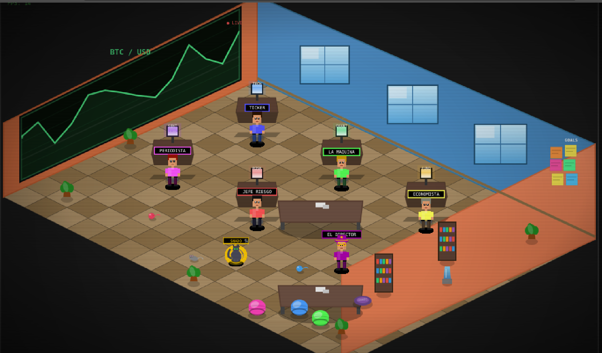

# BTC Trader 🤖⚡

Bot de trading autónomo para **BTC/USDT** que opera sobre **Lightning Network** (wallet Phoenix) y liquida en **USDT sobre Polygon**, usando un comité de agentes y la **API de Claude** para tomar decisiones.



> 🖥️ El **trading floor** en vivo: cada agente del comité (TICKER, PERIODISTA, LA MÁQUINA, JEFE RIESGO, ECONOMISTA, EL DIRECTOR) representado en una oficina isométrica pixel-art, con el chart BTC/USD y el panel de objetivos.

> ⚠️ **Advertencia:** este es un proyecto educativo/experimental que opera con **dinero real**. El trading automatizado de cripto conlleva riesgo de pérdida total. Usalo bajo tu propia responsabilidad y empezá siempre con `--dry-run`.

---

## ¿Cómo funciona?

Cada ciclo, un **orquestador** consulta a 5 agentes especializados y combina sus señales antes de ejecutar (o esperar):

| Agente | Rol |
|--------|-----|
| `technical_agent` | Análisis técnico (tendencia, momentum) |
| `quant_agent` | Volatilidad y métricas cuantitativas |
| `fundamental_agent` | Estado fundamental / PnL |
| `sentiment_agent` | Sentimiento de mercado |
| `risk_agent` | Gestión de riesgo y veto |

La decisión final pasa por `claude_brain.py` (API de Claude), que asigna una **confianza de 0 a 10**. Solo se ejecuta si la confianza ≥ `MIN_CONFIDENCE`.

## Reglas de seguridad (hard limits)

- ❌ Nunca opera si el balance Lightning < 10.000 sats
- 🛑 **Kill-switch**: si la pérdida diaria supera `MAX_DAILY_LOSS_PCT`, se detiene
- ⏳ Si un swap queda pendiente > 10 min, no abre otro
- 🔒 Máximo 1 swap simultáneo
- ✅ Confianza mínima 7/10 para ejecutar

## Stack

- **Python 3.10+**
- [Phoenix](https://phoenix.acinq.co/) — wallet Lightning con API HTTP
- [Boltz API v2](https://docs.boltz.exchange/) — swaps Lightning ↔ on-chain
- Polygon (USDT)
- [Anthropic Claude API](https://docs.anthropic.com/)

## Instalación

```bash
git clone https://github.com/ToRyVand/BTC-Trader.git
cd BTC-Trader

python -m venv venv
source venv/bin/activate
pip install -r requirements.txt

# Configurá tus credenciales
cp .env.example .env
$EDITOR .env
```

## Uso

```bash
# Un solo ciclo de diagnóstico
python bot.py

# Simulación SIN ejecutar trades reales (empezá SIEMPRE por acá)
python bot.py --dry-run

# Loop automático cada 15 minutos
python bot.py --loop

# Loop en modo simulación
python bot.py --loop --dry-run
```

## Verificación antes de operar con dinero real

```bash
python check_system.py
```

Confirmá que:
1. La conexión con Phoenix responde
2. La conexión con Boltz responde
3. `USDT_POLYGON_ADDRESS` y `POLYGON_PRIVATE_KEY` están configurados
4. Hay liquidez de salida suficiente para `TRADE_AMOUNT_SATS`

## Estructura

```
bot.py              # Orquestador principal
claude_brain.py     # Decisiones vía API de Claude
trading_agents/     # Los 5 agentes del comité
boltz.py            # Cliente Boltz API v2
wallet.py           # Cliente wallet Lightning
polygon.py          # Cliente Polygon / USDT
backtest.py         # Backtesting
check_system.py     # Health-check pre-vuelo
journal.jsonl       # Historial de decisiones (NO versionado)
```

## Seguridad 🔐

- El `.env` con tus claves **nunca** se versiona (ver `.gitignore`)
- **Nunca** compartas `POLYGON_PRIVATE_KEY` ni `PHOENIX_PASSWORD`
- Los logs y el `journal.jsonl` están excluidos del repo porque pueden contener montos y direcciones

## Licencia

MIT — usalo, aprendé, mejoralo. Sin garantías.
